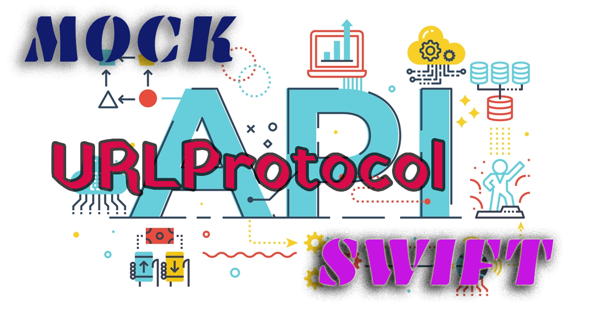

# MockAPIDemo
In the realm of modern software development, agility is paramount. When building applications that rely on external services or APIs, ensuring smooth integration without being tethered to the actual backend implementation is a game-changer. Enter the power of API mocking using Swift’s URLProtocol, an invaluable tool for both unit testing and facilitating rapid development in an agile environment.

 

In this article, we’ll delve into the intricacies of implementing URLProtocol in Swift to mock API services effectively, without the reliance on any third-party libraries. Whether you’re a seasoned developer seeking robust testing strategies or an agile enthusiast looking to expedite frontend development while the backend API is in progress, this comprehensive guide will equip you with the necessary insights and techniques to master API mocking using Swift’s URLProtocol. Let’s embark on a journey to harness the potential of URLProtocol, enabling seamless integration and efficient unit testing in your Swift-based projects.

## Full Medium Article
There is a medium article which has explained steip by step implementation of this project.
 
[Click here to read the full article](https://medium.com/@katramesh91/swift-fast-easy-api-mocking-simplifying-unit-testing-and-service-mocking-using-urlprotocol-ef7d1328fc63)

  

 
